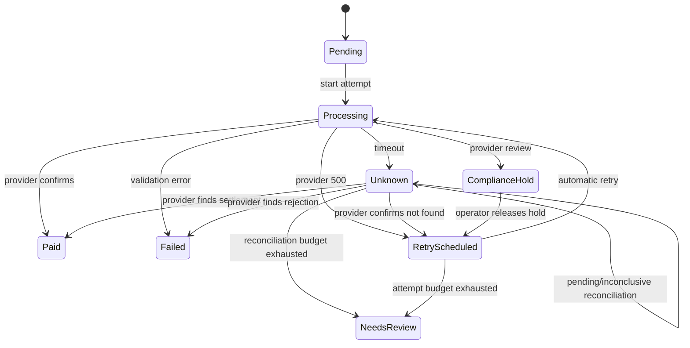

# Architecture

This repository has two deliberately different execution modes.

- The local application is a complete, in-memory learning loop: approve a run, watch independent worker payments, reconcile timeouts, release a compliance hold, and inspect histories.
- The AWS CDK stack is the production-shaped infrastructure track. It synthesizes the resources and executable Go Lambda entrypoints without deploying them.

## Domain flow



A timeout is an ambiguous result, not a failure. Sending again before reconciliation could pay the same worker twice. A confirmed `not_found` result allows a new payment attempt against the same immutable obligation.

The payroll run can be `completed` while `summary.hasIssues` is true. Completion says that every payment reached a terminal state; it does not claim that every payment succeeded.

## Local components

```text
Vue operations UI
       |
       | HTTP + polling
       v
Go net/http API
       |
       v
Workflow engine ----> deterministic mock provider
       |                       |
       +---- payment attempts <-+
       +---- reconciliation attempts
```

Local state is intentionally in memory. Resetting the scenario or restarting the API restores the synthetic September run.

## AWS topology

```text
API Gateway -> API Lambda -> DynamoDB
                                |
                                | stream (transactional outbox records)
                                v
                        Outbox Publisher -> SNS
                                               |
                                  +------------+-----------+
                                  v                        v
                            Payment SQS                 Audit SQS
                                  |
                                  v
                         Effect Worker Lambda

EventBridge schedule -> Reconciler Lambda -> DynamoDB
SQS failures -> DLQs -> CloudWatch alarms
```

The stack in `infra/main.go` includes:

- DynamoDB with on-demand billing, encryption, and streams.
- HTTP API Gateway and an ARM64 Go Lambda.
- SNS fan-out to payment-effect and audit SQS queues.
- Dead-letter queues and CloudWatch alarms.
- A DynamoDB-stream outbox publisher.
- An EventBridge reconciliation schedule.
- Least-scope grants between the constructs.

The Lambda entrypoints are executable adapters. The API Lambda currently hosts the same in-memory demo as local development; connecting the domain to DynamoDB conditional writes and publishing real outbox records is intentionally left as the next production-hardening exercise. Do not treat the deployed demo API as durable.

## Reliability boundaries

- Approval idempotency is modeled at the aggregate and tested.
- Provider HTTP 500 responses retry automatically with a bounded budget.
- Validation failures do not retry.
- Timeouts always reconcile first.
- Reconciliation has a bounded budget and ends in `needs_review` when inconclusive.
- Compliance holds require an operator release; money movement retries remain automatic.
- Payment and reconciliation histories are append-only from the UI's perspective.

For a real system, add DynamoDB conditional expressions, a transactional outbox write in the same approval transaction, provider idempotency keys, authenticated tenant scoping, encrypted secrets, and structured tracing.
